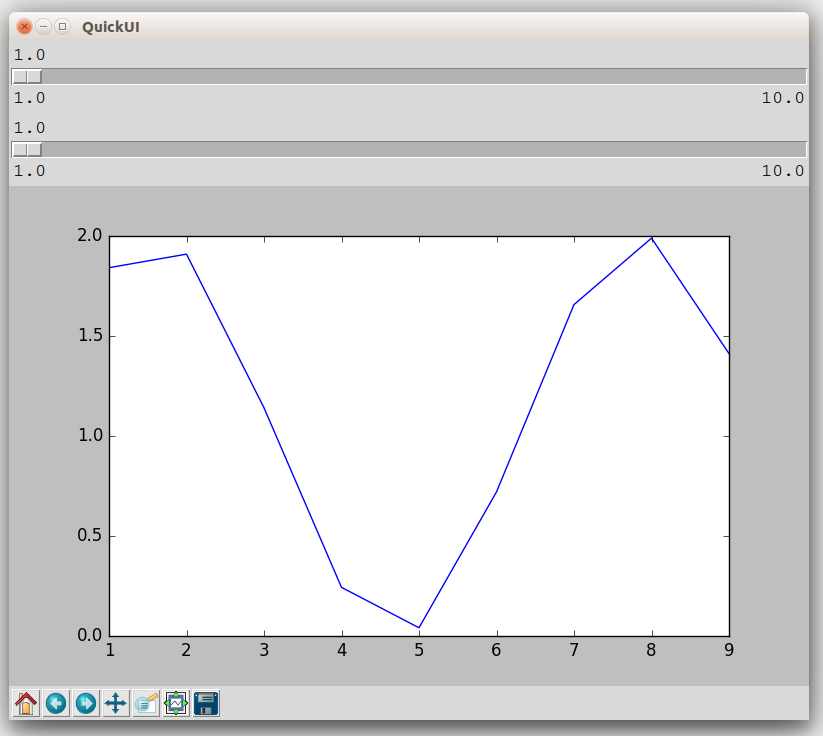

# Python QuickUI

QuickUI is a GUI toolkit and UI library wrapper
around [TkInter](https://wiki.python.org/moin/TkInter) and [Matplotlib](http://matplotlib.org/)
for interactive one-liner toplevel UIs.
It encourages scientists and developers to experiment and prototype
using full fledged GUI applications.
The length of programs QuickUI is designed for are basically simple
one-liners entered into a REPL, thus it is possible to generate
well structured and modern looking GUI windows in just a single line of code.
Also, the standard Python 3 REPL and IPython both automatically display
a QuickUI application without the need to explicitly state a "show-ui" command.
Even though QuickUI excels at interactive one-liner experiences,
it can also be used to build more complex production-ready applications
and is highly extendable.

## Example


### Code

```python
>>> import numpy as np
>>> from quickui import *
>>> forall(a = slider(1,10,0.1), b = slider(1,10,0.1)).show(
...    plot(lambda a,b: [np.arange(1,10), np.sin(np.arange(1,10)**a) + b/a]))
```

### Output



## Documentation

### Basic Application Structure

The QuickUI API is built to fit into one line of code,
therefore the structure of an application is utterly concise.

Each UI begins with a `forall` declaration stating which variables are defined to be represented
by which GUI component.

```python
forall(varname = input_widget, ...)
```

A single `forall` statement is enough to represent a whole GUI application consisting only of inputs.
When `__repr__` is called on a QuickUI object, the GUI automatically displays.
This behavior was set, so that the interactive toplevels instantly show UIs.

Alternatively, the `display_ui` method can be called without arguments
to show the GUI object. This behavior is needed when writing scripts using QuickUI.

After the `forall` call, the `show` method can be invoked with several output widgets
attached to it.

```python
forall(
  varname = input_widget,
  ...
).show(
  output_widget,
  ...
) # optionally: .display_ui()
```

Each output widget takes a callback function as an argument taking every single "*forall*ed" variable
as an argument.

```python
output_widget_constructor(lambda var1, var2, ... : ...)
```

### InputWidget

Each `InputWidget` subclass defines a method with the following API:

- `self.do_your_thing(tk_root_widget, my_name, state)`

Where `state` represents a `QuickUIState` object.

From within this method, the object should invoke `state.put_silent(my_name, initial_value)`
to set the initial value of the variable assigned to the `InputWidget`.

Then the TkInter callbacks should invoke `state.put(my_name, updated_value)` to change
not only the variable silently, but to allow `OutputWidget`s to react to that state change.

#### Subclasses

- `slider(start, end, steps = None)`

### OutputWidget

Each `OutputWidget` subclass defines two methods with the following API:

- `self.init_ui(tk_root_widget)`
- `self.update(variable_dict)`

The `init_ui` method should be used to set up TkInter widgets,
whereas from within `update` the state of those widgets should be changed
with respect to the passed variable dictionary containing `varname/current_value` pairs.

### Subclasses

- `label(lambda *vars: string)`
- `plot(lambda *vars: [xaxis, yaxis])`
